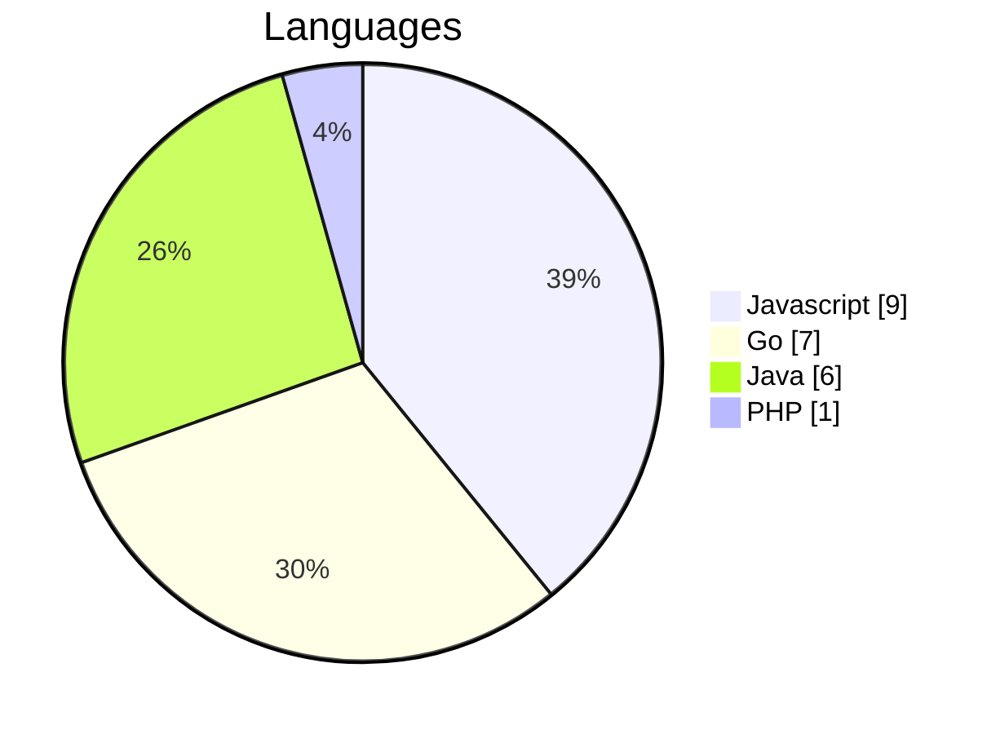
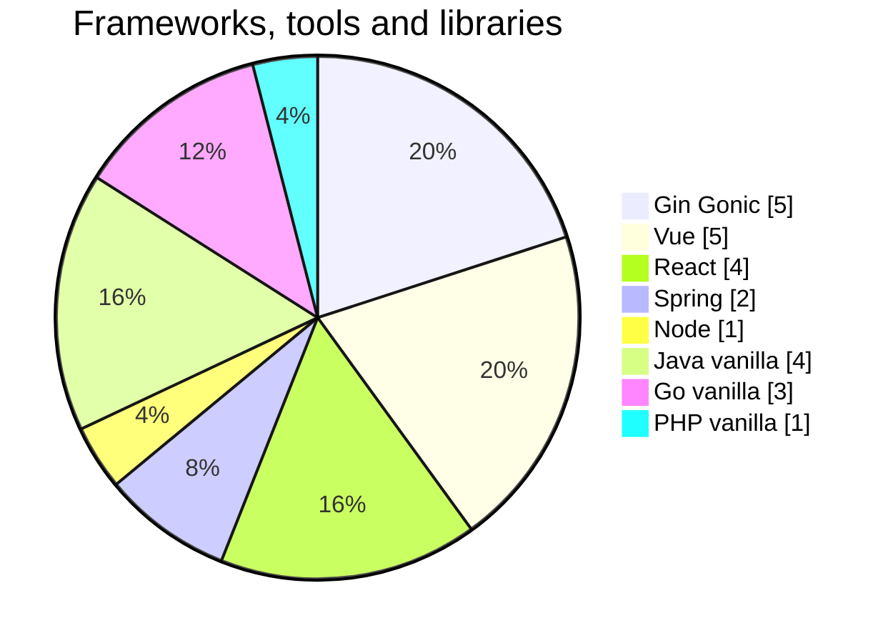

<h2 align="center">Hi 👋, I'm Pedro Pérez</h1>
&nbsp;

I'm geek, not nerd. Very lazy, I work smart, not hard.

&nbsp;
<h2  align="center">⚙ Factótum</h2>

<h3 align="center">Back </h3>

<h3 align="center"> Front </h3>

<h3 align="center"> Frameworks and libraries </h3>

<h3 align="center"> Deploys </h3>

<h3 align="center"> Trash </h3>

&nbsp;
&nbsp;
<h2  align="center">📫 Reach me on</h2>
&nbsp;

  &nbsp;&nbsp;&nbsp;&nbsp;
  

&nbsp;
&nbsp;
&nbsp;

<h2  align="center">📈 Stats</h2>

By number of repositories

<h2  align="center">📚 Books I've read </h2>
 
El limpiadro de código

Código limpio

Arquitectura limpia

El mítico Hombre-Mes

El programador pragmático

